  
# 📡 Signal Received: Rakesh Kumar Sahoo is Online!

# 💫 About Me:

👋 **Hi, I'm Rakesh 😎**

IT Operations & CloudOps professional with nearly 4 years of production experience in application support, monitoring, live-content workflows and technology operations.

I work across **Linux, Bash/Shell, AWS, automation, CI/CD, Docker and Kubernetes**, with an MBA in **Operations & Systems**. My focus is on connecting technology, operational processes and measurable business outcomes.

### 🔭 Current Focus

- ☁️ CloudOps & DevOps automation
- 🐧 Linux & production troubleshooting
- 🐳 Containerized workloads with Docker & Kubernetes
- ⚙️ AWS infrastructure and application operations
- 📊 Monitoring & operational reliability
- 💰 FinOps & cloud cost awareness
- 🏗️ Infrastructure automation with Terraform & Ansible

### ⚙️ My Approach

> **Automate what is repetitive.**  
> **Troubleshoot with evidence.**  
> **Improve what can be measured.**

### 💬 Ask me about

**Linux | Bash | AWS | CloudOps | TechOps | Application Support | CI/CD | Docker | Kubernetes | Monitoring | FinOps | Automation**

## 🌐 Socials:

# 💻 Tech Stack:

### 🐧 Linux & Scripting

### ☁️ AWS

### ⚙️ DevOps & Automation

### 📊 Monitoring & Operations

### 🗄️ Data & Reporting

---

# 🐍 GitHub Contribution Snake

---

# 📊 GitHub Stats:

 

 

---

# 🏆🏅 GitHub Achievements & Trophies

---

### ✍️ Random Dev Quote

---

# 🧭 Learning & Career Hub

Every job role I am preparing for has its own repository. Each one holds the roadmap, the notes, the interview Q&A and the hands-on projects for that role, and only for that role. Nothing is repeated between repositories. If a tool such as Kubernetes appears in more than one role, each repository covers it only from that role's point of view.

Together they make up a public study library and portfolio. Anyone is welcome to read, learn from it and suggest improvements.

## 📚 Role repositories

| Role | What the repository covers | Repository | Status |
|---|---|---|---|
| 🐧 Linux | Linux administration, shell, troubleshooting, production problems and a 15-volume interview Q&A series | [Linux_A2Z](https://github.com/therakeshkumarr/Linux_A2Z) | 🚧 In progress |
| ☁️ CloudOps | AWS operations, cloud monitoring, backup and recovery, day-to-day cloud administration | [CloudOps_A2Z](https://github.com/therakeshkumarr/CloudOps_A2Z) | 📝 Planned |
| ⚙️ DevOps | CI/CD, containers, infrastructure as code, automation and delivery workflows | [DevOps_A2Z](https://github.com/therakeshkumarr/DevOps_A2Z) | 📝 Planned |
| 🔐 DevSecOps | Security built into the delivery pipeline: scanning, secrets, policy and compliance | [DevSecOps_A2Z](https://github.com/therakeshkumarr/DevSecOps_A2Z) | 📝 Planned |
| 💰 FinOps | Cloud cost visibility, allocation, budgets, optimisation and reporting | [FinOps_A2Z](https://github.com/therakeshkumarr/FinOps_A2Z) | 📝 Planned |
| 🖥️ ITOps | IT service management, incident handling, support processes and documentation | [ITOps_A2Z](https://github.com/therakeshkumarr/ITOps_A2Z) | 📝 Planned |
| 🛠️ TechOps | Servers, networks, virtualisation, backup and disaster recovery, monitoring and reporting | [TechOps_A2Z](https://github.com/therakeshkumarr/TechOps_A2Z) | 📝 Planned |
| 📈 SRE | SLIs and SLOs, observability, on-call, incident response and postmortems | [SRE_A2Z](https://github.com/therakeshkumarr/SRE_A2Z) | 📝 Planned |
| 🧱 Platform Engineering | Internal developer platforms, self-service, golden paths and platform operations | [Platform_Engineering_A2Z](https://github.com/therakeshkumarr/Platform_Engineering_A2Z) | 📝 Planned |
| 🗂️ Operations Management | SLA and KPI management, process improvement, capacity, risk and operational reporting | [Operations_Management_A2Z](https://github.com/therakeshkumarr/Operations_Management_A2Z) | 📝 Planned |
| 📦 Supply Chain Management | Demand planning, inventory, procurement, logistics and supply chain analytics | [SupplyChain_Management_A2Z](https://github.com/therakeshkumarr/SupplyChain_Management_A2Z) | 📝 Planned |
| 📋 Business Analytics | Requirements, user stories, business reports, advanced Excel, sprint work and stakeholder communication | [Business_Analytics_A2Z](https://github.com/therakeshkumarr/Business_Analytics_A2Z) | 📝 Planned |
| 📊 Data Analytics | SQL, Python, Excel, statistics, data cleaning, Power BI and Tableau projects | [Data_Analytics_A2Z](https://github.com/therakeshkumarr/Data_Analytics_A2Z) | 📝 Planned |

> **About the status column.** 🚧 means the repository is being built now. 📝 means it is planned and the link may show a "page not found" message until I create it. I update this table as each repository goes live.

## 🧩 How each repository is organised

Every repository follows the same layout, so once you know one you can find your way around all of them.

| Folder | Purpose |
|---|---|
| `00_Roadmap_and_Study_Plan` | Beginner to advanced learning order, checklists and progress tracking |
| Numbered topic folders | One folder per topic, each with its own `README.md` covering the objective, concepts, commands, labs and troubleshooting |
| `Interview_QA` | Questions and answers for that role, from basic to senior level |
| `Projects` | Hands-on builds. Each project folder has a single self-contained `README.md` |
| `Learning_Resources` | Official documentation and trusted references |

## 🎯 How I study

1. Learn the concept.
2. Build a small working system.
3. Break it on purpose.
4. Troubleshoot with evidence.
5. Write down what failed and how it was fixed.
6. Think about what would change in production.

> **Learn. Build. Break. Troubleshoot. Secure. Improve.**

## 🔗 Where to find me and the live sites

- **Repositories:** every role repository above is public and open for reading.
- **Live site:** I am setting up a hub website where each role repository will be published as a readable site. The link will be added here when it is live.
- **Connect:** [LinkedIn](https://linkedin.com/in/therakeshkumar) · [X](https://x.com/_TheRakeshkumar) · [Email](mailto:rakeshkumarsahoo299@gmail.com)

---

  <strong>👁️ Profile Activity</strong>

  <strong>🔨 Build → ⚙️ Automate → 🔍 Troubleshoot → 🚀 Improve</strong>

